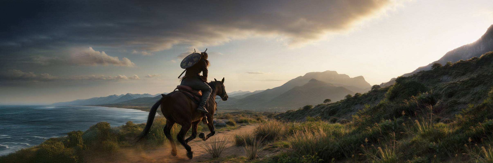

# Osman Ghazi: Ottoman Rising - Official Website

A cinematic AAA-quality gaming website built with React, featuring a dark aesthetic inspired by historical action-adventure games. The site showcases the legendary story of Osman Ghazi, the founder of the Ottoman Empire.



## ✨ Features

- **Cinematic Dark Theme**: Purple, blue, black, and gold color scheme with smooth animations
- **Multilingual Support**: Full support for English, French, and Arabic (including RTL layout)
- **Responsive Design**: Optimized for mobile, tablet, and desktop devices
- **Interactive Components**:
  - Parallax hero section with smooth scrolling
  - Image gallery with modal viewer
  - Expandable FAQ accordion
  - Newsletter subscription
  - Contact form
- **Comprehensive Sections**:
  - Hero banner
  - Story introduction
  - Features showcase
  - World exploration
  - Character profiles
  - Edition comparison (Standard, Deluxe, Collector's)
  - Media gallery
  - Development roadmap
  - Community hub
  - FAQ section
  - Contact form

## 🚀 Tech Stack

- **Frontend**: React 18, TypeScript, Vite
- **Styling**: Tailwind CSS, shadcn/ui components
- **Backend**: Express.js, Node.js
- **State Management**: TanStack Query
- **Routing**: Wouter
- **Forms**: React Hook Form + Zod validation
- **Icons**: Lucide React, React Icons

## 📦 Installation

```bash
# Install dependencies
npm install

# Start development server
npm run dev

# Build for production
npm run build

# Start production server
npm start
```

## 🌐 Deployment to Vercel

This project is configured for seamless deployment to Vercel. See [VERCEL_DEPLOYMENT.md](./VERCEL_DEPLOYMENT.md) for detailed instructions.

### Quick Deploy

[](https://vercel.com/new/clone?repository-url=YOUR_REPO_URL)

### Manual Deployment

1. Push your code to a Git repository (GitHub, GitLab, or Bitbucket)
2. Go to [vercel.com/new](https://vercel.com/new)
3. Import your repository
4. Vercel will auto-detect the configuration
5. Click "Deploy"

## 🛠️ Project Structure

```
.
├── client/                 # Frontend application
│   ├── src/
│   │   ├── components/    # React components
│   │   ├── lib/           # Utilities and contexts
│   │   ├── pages/         # Page components
│   │   └── hooks/         # Custom React hooks
│   └── index.html
├── server/                # Backend application
│   ├── routes.ts          # API routes
│   └── index.ts           # Server entry point
├── attached_assets/       # Static game assets
├── vercel.json           # Vercel configuration
└── api/                  # Vercel serverless functions
```

## 🎨 Color Scheme

The website uses a carefully crafted dark theme:

- **Primary Purple**: `hsl(265, 85%, 58%)` - Main brand color
- **Secondary Blue**: `hsl(225, 70%, 55%)` - Accent color
- **Accent Gold**: `hsl(43, 100%, 50%)` - Highlights and CTAs
- **Dark Background**: `hsl(0, 0%, 0%)` - Pure black base
- **Card Background**: `hsl(265, 30%, 8%)` - Elevated surfaces

## 🌍 Internationalization

The website supports three languages:

- **English (EN)** - Default
- **French (FR)** - Français
- **Arabic (AR)** - العربية (with RTL layout)

Language can be switched using the language selector in the header.

## 📝 Environment Variables

For production deployment, configure these environment variables:

```env
SESSION_SECRET=your_session_secret_here
NODE_ENV=production
RESEND_API_KEY=re_xxxxxxxxx
CONTACT_TO_EMAIL=info@breakingwalls.co
CONTACT_FROM_EMAIL="Venus Website <info@breakingwalls.co>"
```

### Contact Email Setup (Resend)

1. Create a Resend account at [resend.com](https://resend.com).
2. Verify your sending domain in Resend (`Domains` tab) and add SPF/DKIM DNS records.
3. Copy your API key into `RESEND_API_KEY`.
4. Set `CONTACT_FROM_EMAIL` to `info@breakingwalls.co` (on your verified domain).
5. Set `CONTACT_TO_EMAIL` to the inbox that should receive contact form submissions.
6. Add the same variables in Vercel:
   - Project `Settings` -> `Environment Variables`
   - Add for `Production`, `Preview`, and `Development` as needed

The contact form posts to `/api/contact` and now works in both local dev (`npm run dev`) and Vercel deployments.

## 🧩 Key Components

### Header
Sticky navigation with language selector and smooth scroll links.

### Hero
Full-screen parallax section with animated logo and call-to-action buttons.

### Story
Narrative introduction with character portrait and story text.

### Features
Grid layout showcasing six key game features with icons.

### World
Location cards highlighting different areas of the game world.

### Characters
Main character spotlight plus companion cards.

### Editions
Three-column comparison of game editions with feature lists.

### Media Gallery
Screenshot grid with modal image viewer.

### Roadmap
Timeline visualization of development milestones.

### Community
Social media links and newsletter subscription.

### FAQ
Accordion-style frequently asked questions.

### Contact
Contact form and press kit download section.

## 🎮 Ad Placements

The website includes placeholder sections for advertisements:

- **Leaderboard**: 728x90 (Hero section)
- **Medium Rectangle**: 300x250 (Editions section)
- **Skyscraper**: 160x600 (Community section, desktop only)

## 📱 Responsive Breakpoints

- **Mobile**: < 640px
- **Tablet**: 640px - 1024px
- **Desktop**: > 1024px

## 🔧 Development

### Code Style
- TypeScript for type safety
- ESLint for code quality
- Prettier for formatting (configured in project)

### Component Guidelines
- Use shadcn/ui components for UI elements
- Follow the hover-elevate pattern for interactive elements
- Maintain consistent spacing using Tailwind utilities
- Add data-testid attributes for all interactive elements

## 📄 License

© 2025 Ottoman Rising Games Co., Ltd. All Rights Reserved.

## 🤝 Contributing

This is a showcase project for a fictional game. For business inquiries, please use the contact form on the website.

## 📞 Support

For technical issues or questions about deployment, please refer to:
- [Vercel Documentation](https://vercel.com/docs)
- [React Documentation](https://react.dev)
- [Tailwind CSS Documentation](https://tailwindcss.com/docs)

---

Built with ⚔️ by the Ottoman Rising Games team
